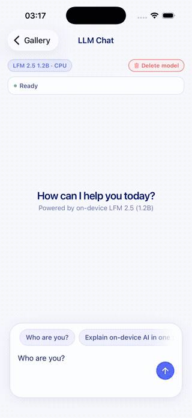
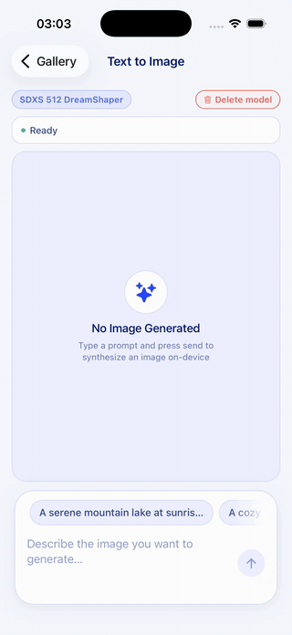
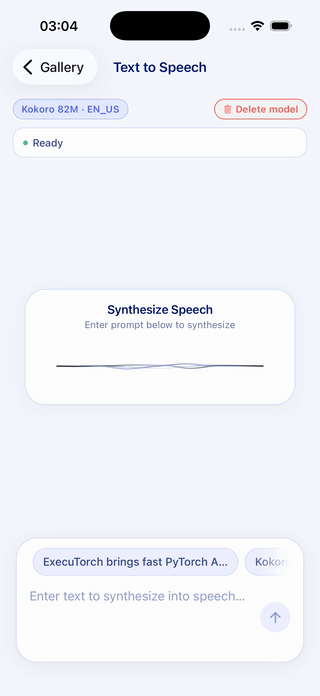
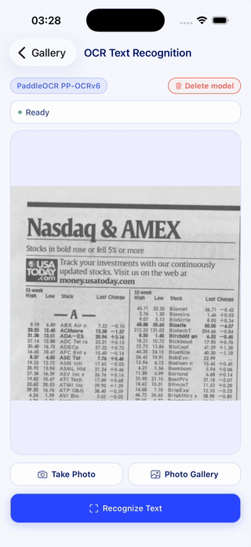
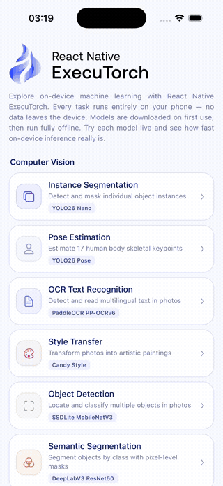
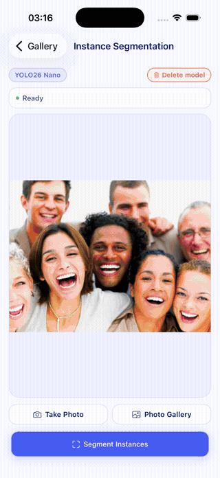
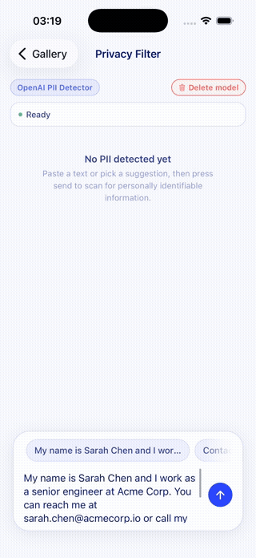
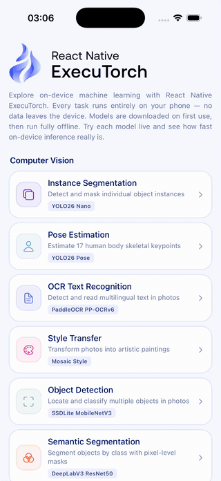

<div align="center">
  <picture>
    <source media="(prefers-color-scheme: dark)" srcset="https://github.com/software-mansion/react-native-executorch/raw/main/docs/static/img/logo-vertical-dark.svg">
    
  </picture>
  <br />
  <br />
  
</div>

<br />
<br />

**React Native ExecuTorch Gallery** is a showcase app demonstrating on-device
machine learning tasks built with
[`react-native-executorch`](https://github.com/software-mansion/react-native-executorch).
Each screen is a real, standalone example of idiomatic library usage, so it can
be lifted straight into your own app.

<div align="center">

|                              LLM Chat (LFM 2.5)                               |                                 Text to Image (SDXS)                                  |                         Text to Speech (Kokoro)                         |                        OCR Text Recognition                         |
| :---------------------------------------------------------------------------: | :-----------------------------------------------------------------------------------: | :---------------------------------------------------------------------: | :-----------------------------------------------------------------: |
|                    |                  |  |        |
|                         **Multimodal Search (CLIP)**                          |                               **Instance Segmentation**                               |                        **Privacy Filter (PII)**                         |                        **Gallery Overview**                         |
|  |  |  |  |

</div>

## Getting Started

```bash
npm install
npm run ios       # or npm run android
```

> The app requires a development build (Expo Go is not supported). Models are
> downloaded on first use and then run fully offline.

## Requirements

- React Native with the **New Architecture**
- Expo SDK 57+ or React Native 0.74+

## Development & Local Linking

This showcase app is developed against the `rne-rewrite` branch of [`react-native-executorch`](https://github.com/software-mansion/react-native-executorch).

Because the gallery consumes `react-native-executorch` as a standard npm dependency with native modules rather than an npm workspace symlink, local development uses a local [Verdaccio](https://verdaccio.org/) registry (`http://localhost:4873`):

1. **Start Verdaccio**:

   ```bash
   npx verdaccio
   ```

2. **Authenticate & Publish the library** (from the `react-native-executorch` repository):

   ```bash
   # Log in once to your local Verdaccio registry (enter any username/password)
   npm adduser --registry http://localhost:4873

   # Build and publish react-native-executorch
   cd packages/react-native-executorch
   npm publish --registry http://localhost:4873 --tag dev
   ```

3. **Install in the gallery**:

   ```bash
   # In react-native-executorch-gallery:
   npm install react-native-executorch@dev --registry http://localhost:4873
   ```

4. **Run the app**:

   ```bash
   npx pod-install   # for iOS
   npm run ios       # or npm run android
   ```

## Documentation

The full library documentation lives in
[`react-native-executorch`](https://github.com/software-mansion/react-native-executorch).
Each task screen in this repository maps directly to a page in the docs.

## Created by Software Mansion

This project is developed by [Software Mansion](https://swmansion.com/).
